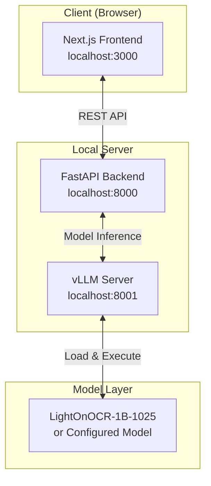
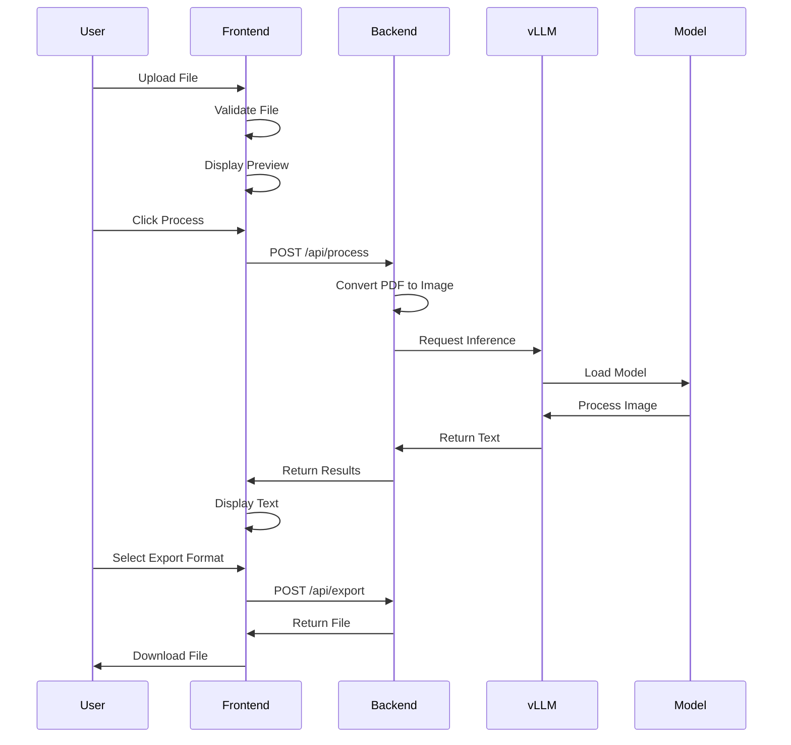
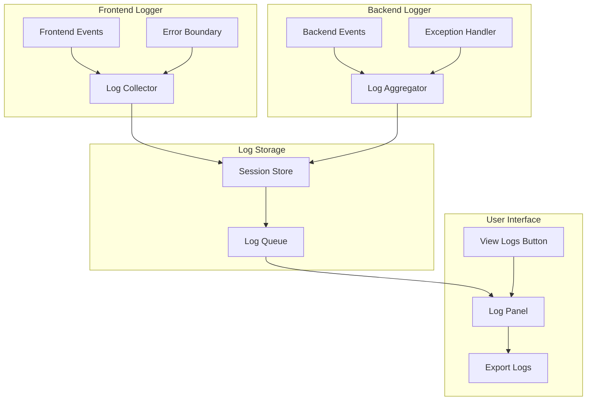

# OCR-harness Design Document

## 1. System Architecture

### 1.1 High-Level Architecture



### 1.2 Technology Stack

#### Frontend
- **Framework:** Next.js 14+ (App Router)
- **Language:** TypeScript
- **Styling:** Tailwind CSS + shadcn/ui
- **State Management:** React Context + Zustand
- **File Handling:** react-dropzone
- **PDF Rendering:** PDF.js
- **HTTP Client:** Axios
- **Export Libraries:** 
  - xlsx (Excel export)
  - papaparse (CSV handling)

#### Backend
- **Framework:** FastAPI
- **Language:** Python 3.11+
- **Model Serving:** vLLM
- **PDF Processing:** pypdfium2
- **Image Processing:** Pillow
- **Configuration:** PyYAML
- **CORS:** fastapi-cors

### 1.3 Directory Structure

```
ocr-harness/
├── frontend/
│   ├── app/
│   │   ├── layout.tsx
│   │   ├── page.tsx
│   │   └── api/
│   ├── components/
│   │   ├── ui/           # shadcn/ui components
│   │   ├── UploadZone.tsx
│   │   ├── DocumentPreview.tsx
│   │   ├── SettingsPanel.tsx
│   │   ├── ResultsView.tsx
│   │   └── ExportControls.tsx
│   ├── lib/
│   │   ├── api.ts
│   │   ├── utils.ts
│   │   └── types.ts
│   ├── hooks/
│   └── package.json
│
├── backend/
│   ├── app/
│   │   ├── main.py
│   │   ├── models/
│   │   ├── routes/
│   │   ├── services/
│   │   └── utils/
│   ├── config/
│   │   ├── models.yaml    # Model configurations
│   │   └── settings.py
│   ├── requirements.txt
│   └── start_backend.sh
│
├── scripts/
│   └── start.sh           # One-command startup
├── docker-compose.yml     # Optional container setup
└── README.md
```

### 1.4 Model Configuration Schema

```yaml
# backend/config/models.yaml
models:
  default: "lighton-ocr-1b"
  
  configurations:
    lighton-ocr-1b:
      name: "LightOnOCR-1B-1025"
      display_name: "LightOn OCR 1B (1025)"
      model_path: "lightonai/LightOnOCR-1B-1025"
      server_port: 8001
      parameters:
        temperature: 0.2
        top_p: 0.9
        max_tokens: 6500
        render_dpi: 300
        max_dimension: 1300
      requirements:
        min_ram_gb: 8
        recommended_ram_gb: 16
        gpu_recommended: true
    
    # Future model example
    custom-ocr-model:
      name: "custom-model-id"
      display_name: "Custom OCR Model"
      model_path: "path/to/model"
      # ... configuration
```

## 2. UI/UX Design

### 2.1 Layout Specification

```
┌────────────────────────────────────────────────────────────────┐
│  [Logo] OCR-harness                                            │
│         LightOn OCR 1B (1025)                    [Settings ⚙]  │
├────────────────────────────────────────────────────────────────┤
│                                                                 │
│  ┌─────────────────────┬────────────────────────────────────┐ │
│  │                     │                                    │ │
│  │    Upload Zone      │      Document Preview              │ │
│  │                     │                                    │ │
│  │  [Drag & Drop       │      [Original Document]           │ │
│  │   or Browse]        │                                    │ │
│  │                     │                                    │ │
│  │  Supported:         │      [Zoom In] [Zoom Out]          │ │
│  │  • PDF              │                                    │ │
│  │  • PNG/JPG          │                                    │ │
│  │                     │                                    │ │
│  └─────────────────────┴────────────────────────────────────┘ │
│                                                                 │
│  ┌──────────────────────────────────────────────────────────┐ │
│  │                 Extracted Text                            │ │
│  │  ┌────────────────────────────────────────────────────┐  │ │
│  │  │                                                    │  │ │
│  │  │  [Extracted text will appear here after           │  │ │
│  │  │   processing...]                                   │  │ │
│  │  │                                                    │  │ │
│  │  └────────────────────────────────────────────────────┘  │ │
│  └──────────────────────────────────────────────────────────┘ │
│                                                                 │
│  ┌──────────────────────────────────────────────────────────┐ │
│  │  [Process] [Clear]  Export as: [TXT] [CSV] [XLSX]        │ │
│  └──────────────────────────────────────────────────────────┘ │
└────────────────────────────────────────────────────────────────┘
```

### 2.2 Component Specifications

#### Header
- **Title:** "OCR-harness" in bold, large font
- **Subtitle:** Current model name in smaller, muted text
- **Settings Icon:** Opens modal with model parameters

#### Upload Zone (Left Panel)
- **Dimensions:** 30% width, 400px height
- **Style:** Dashed border, subtle background
- **States:**
  - Default: "Drag & Drop files here or click to browse"
  - Hover: Highlight with primary color
  - Processing: Disabled with loading indicator
  - Error: Red border with error message

#### Document Preview (Right Panel)
- **Dimensions:** 70% width, 400px height
- **Features:**
  - Pan and zoom controls
  - Page navigation for multi-page PDFs
  - Responsive image scaling

#### Results Panel
- **Height:** 300px (expandable)
- **Features:**
  - Scrollable text area
  - Copy-to-clipboard button
  - Line numbers (optional)
  - Text search capability

#### Settings Modal
```
┌─────────────────────────────┐
│     Model Configuration     │
├─────────────────────────────┤
│ Temperature: [====] 0.2     │
│ Top-p:      [======] 0.9    │
│ Max Tokens: [6500]          │
│                             │
│ [Reset] [Cancel] [Apply]    │
└─────────────────────────────┘
```

### 2.3 Color Scheme

```css
:root {
  --primary: #0070f3;
  --primary-dark: #0051cc;
  --background: #ffffff;
  --foreground: #000000;
  --muted: #666666;
  --border: #e5e5e5;
  --error: #ee0000;
  --success: #00aa00;
}

@media (prefers-color-scheme: dark) {
  :root {
    --background: #0a0a0a;
    --foreground: #ffffff;
    --border: #333333;
  }
}
```

## 3. API Design

### 3.1 Endpoints

#### POST /api/process
```typescript
interface ProcessRequest {
  file: File;
  config?: {
    temperature?: number;
    top_p?: number;
    max_tokens?: number;
  };
}

interface ProcessResponse {
  success: boolean;
  text?: string;
  metadata?: {
    pages: number;
    processing_time: number;
    model_used: string;
  };
  error?: string;
}
```

#### GET /api/models
```typescript
interface ModelsResponse {
  current: string;
  available: Array<{
    id: string;
    name: string;
    display_name: string;
  }>;
}
```

#### POST /api/export
```typescript
interface ExportRequest {
  text: string;
  format: 'txt' | 'csv' | 'xlsx';
  metadata?: any;
}

interface ExportResponse {
  success: boolean;
  file_url?: string;
  error?: string;
}
```

### 3.2 Error Handling

```typescript
enum ErrorCodes {
  INVALID_FILE = 'INVALID_FILE',
  PROCESSING_FAILED = 'PROCESSING_FAILED',
  MODEL_UNAVAILABLE = 'MODEL_UNAVAILABLE',
  EXPORT_FAILED = 'EXPORT_FAILED'
}

interface ErrorResponse {
  error: ErrorCodes;
  message: string;
  details?: any;
}
```

## 4. Processing Flow



## 5. Security Considerations

### 5.1 Input Validation
- File type validation (whitelist approach)
- File size limits (50MB default)
- Filename sanitization
- Content-type verification

### 5.2 Data Privacy
- No persistent storage of uploaded files
- Temporary files deleted after processing
- No logging of extracted text content
- Session-based isolation

### 5.3 API Security
- CORS configuration for frontend origin only
- Rate limiting on processing endpoints
- Request size limits
- Input sanitization

## 6. Performance Optimization

### 6.1 Frontend
- Lazy loading of components
- Image optimization with next/image
- Code splitting
- Debounced API calls

### 6.2 Backend
- Async processing with FastAPI
- Connection pooling for vLLM
- Efficient file streaming
- Memory management for large PDFs

### 6.3 Model Serving
- Model preloading on startup
- Batch processing capability
- GPU acceleration when available
- Response streaming for large outputs

## 7. Mobile Blocking Implementation

```typescript
// components/MobileBlocker.tsx
const MobileBlocker: React.FC = () => {
  const isMobile = useMediaQuery('(max-width: 768px)');
  
  if (!isMobile) return null;
  
  return (
    <div className="fixed inset-0 bg-background z-50 flex items-center justify-center p-8">
      <div className="text-center">
        <h1 className="text-2xl font-bold mb-4">Desktop Required</h1>
        <p className="text-muted-foreground">
          This OCR experience works best on desktop or laptop devices.
          Please access from a larger screen for optimal performance.
        </p>
      </div>
    </div>
  );
};
```

## 8. Configuration Management

### 8.1 Environment Variables

```bash
# Frontend (.env.local)
NEXT_PUBLIC_API_URL=http://localhost:8000
NEXT_PUBLIC_MAX_FILE_SIZE=52428800

# Backend (.env)
VLLM_SERVER_URL=http://localhost:8001
MODEL_CONFIG_PATH=./config/models.yaml
TEMP_DIR=/tmp/ocr-harness
CORS_ORIGINS=["http://localhost:3000"]
```

### 8.2 Dynamic Model Loading

```python
# backend/services/model_service.py
class ModelService:
    def __init__(self, config_path: str):
        self.config = self.load_config(config_path)
        self.current_model = self.config['default']
    
    def load_config(self, path: str) -> dict:
        with open(path, 'r') as f:
            return yaml.safe_load(f)
    
    def get_model_params(self) -> dict:
        return self.config['configurations'][self.current_model]
    
    def switch_model(self, model_id: str):
        if model_id in self.config['configurations']:
            self.current_model = model_id
            self.reload_vllm_server()
```

## 9. Error Logging and Diagnostics System

### 9.1 Logging Architecture



### 9.2 Log Data Structure

```typescript
interface LogEntry {
  id: string;
  timestamp: Date;
  level: 'INFO' | 'WARNING' | 'ERROR' | 'DEBUG';
  source: 'FRONTEND' | 'BACKEND' | 'MODEL' | 'SYSTEM';
  component: string;
  message: string;
  details?: {
    errorCode?: string;
    stackTrace?: string;
    userAction?: string;
    fileName?: string;  // Only filename, not content
    fileSize?: number;
    processingTime?: number;
    modelConfig?: object;
  };
  sessionId: string;
}

interface LogSession {
  sessionId: string;
  startTime: Date;
  logs: LogEntry[];
  systemInfo: {
    browser: string;
    os: string;
    screenResolution: string;
    modelUsed: string;
  };
}
```

### 9.3 Frontend Logger Implementation

```typescript
// lib/logger.ts
class FrontendLogger {
  private logs: LogEntry[] = [];
  private maxLogs = 1000;
  private sessionId: string;

  constructor() {
    this.sessionId = this.generateSessionId();
    this.setupErrorBoundary();
    this.interceptConsoleErrors();
  }

  log(level: LogLevel, message: string, details?: any) {
    const entry: LogEntry = {
      id: nanoid(),
      timestamp: new Date(),
      level,
      source: 'FRONTEND',
      component: this.getCallerComponent(),
      message,
      details: this.sanitizeDetails(details),
      sessionId: this.sessionId
    };
    
    this.logs.push(entry);
    this.trimLogs();
    this.persistToStorage(entry);
  }

  private sanitizeDetails(details: any): any {
    // Remove sensitive information
    const sanitized = { ...details };
    delete sanitized.fileContent;
    delete sanitized.extractedText;
    return sanitized;
  }

  private setupErrorBoundary() {
    window.addEventListener('error', (event) => {
      this.log('ERROR', event.message, {
        stackTrace: event.error?.stack,
        filename: event.filename,
        line: event.lineno,
        column: event.colno
      });
    });

    window.addEventListener('unhandledrejection', (event) => {
      this.log('ERROR', 'Unhandled Promise Rejection', {
        reason: event.reason
      });
    });
  }

  exportLogs(format: 'json' | 'txt'): Blob {
    if (format === 'json') {
      return new Blob([JSON.stringify(this.logs, null, 2)], {
        type: 'application/json'
      });
    }
    
    const text = this.logs.map(log => 
      `[${log.timestamp.toISOString()}] ${log.level} - ${log.component}: ${log.message}`
    ).join('\n');
    
    return new Blob([text], { type: 'text/plain' });
  }
}

export const logger = new FrontendLogger();
```

### 9.4 Backend Logger Implementation

```python
# backend/utils/logger.py
import logging
import json
from datetime import datetime
from typing import Dict, Any
from fastapi import Request
from uuid import uuid4

class BackendLogger:
    def __init__(self):
        self.logs = []
        self.max_logs = 1000
        self.setup_logging()
    
    def setup_logging(self):
        logging.basicConfig(
            level=logging.INFO,
            format='%(asctime)s - %(name)s - %(levelname)s - %(message)s'
        )
        
        # Custom handler to capture logs
        handler = LogCollectorHandler(self)
        logging.getLogger().addHandler(handler)
    
    def log(self, level: str, message: str, details: Dict[str, Any] = None):
        """Log an entry with sanitized details"""
        entry = {
            "id": str(uuid4()),
            "timestamp": datetime.now().isoformat(),
            "level": level,
            "source": "BACKEND",
            "component": self.get_caller_info(),
            "message": message,
            "details": self.sanitize_details(details),
            "sessionId": self.get_session_id()
        }
        
        self.logs.append(entry)
        self.trim_logs()
        return entry
    
    def sanitize_details(self, details: Dict[str, Any]) -> Dict[str, Any]:
        """Remove sensitive information from logs"""
        if not details:
            return {}
        
        sanitized = details.copy()
        # Remove file contents and extracted text
        sensitive_keys = ['file_content', 'extracted_text', 'image_data']
        for key in sensitive_keys:
            sanitized.pop(key, None)
        
        return sanitized
    
    def get_logs(self, session_id: str = None, level: str = None):
        """Retrieve logs with optional filtering"""
        filtered_logs = self.logs
        
        if session_id:
            filtered_logs = [l for l in filtered_logs if l.get('sessionId') == session_id]
        
        if level:
            filtered_logs = [l for l in filtered_logs if l.get('level') == level]
        
        return filtered_logs

logger = BackendLogger()

# Exception handler middleware
async def log_exceptions(request: Request, call_next):
    try:
        response = await call_next(request)
        return response
    except Exception as e:
        logger.log('ERROR', f"Unhandled exception: {str(e)}", {
            "path": request.url.path,
            "method": request.method,
            "stackTrace": traceback.format_exc()
        })
        raise
```

### 9.5 Log Viewer UI Component

```typescript
// components/LogViewer.tsx
import { useState, useEffect } from 'react';
import { logger } from '@/lib/logger';

const LogViewer = ({ isOpen, onClose }) => {
  const [logs, setLogs] = useState<LogEntry[]>([]);
  const [filter, setFilter] = useState<LogLevel | 'ALL'>('ALL');
  const [autoScroll, setAutoScroll] = useState(true);

  useEffect(() => {
    const interval = setInterval(() => {
      setLogs(logger.getLogs());
    }, 1000);
    
    return () => clearInterval(interval);
  }, []);

  const filteredLogs = logs.filter(log => 
    filter === 'ALL' || log.level === filter
  );

  const exportLogs = (format: 'json' | 'txt') => {
    const blob = logger.exportLogs(format);
    const url = URL.createObjectURL(blob);
    const a = document.createElement('a');
    a.href = url;
    a.download = `ocr-harness-logs-${Date.now()}.${format}`;
    a.click();
  };

  const getLevelColor = (level: LogLevel) => {
    switch (level) {
      case 'ERROR': return 'text-red-500';
      case 'WARNING': return 'text-yellow-500';
      case 'INFO': return 'text-blue-500';
      case 'DEBUG': return 'text-gray-500';
    }
  };

  return (
    <Sheet open={isOpen} onOpenChange={onClose}>
      <SheetContent className="w-[600px] sm:max-w-[600px]">
        <SheetHeader>
          <SheetTitle>System Logs</SheetTitle>
        </SheetHeader>
        
        <div className="flex gap-2 my-4">
          <Select value={filter} onValueChange={setFilter}>
            <SelectTrigger className="w-32">
              <SelectValue />
            </SelectTrigger>
            <SelectContent>
              <SelectItem value="ALL">All</SelectItem>
              <SelectItem value="ERROR">Errors</SelectItem>
              <SelectItem value="WARNING">Warnings</SelectItem>
              <SelectItem value="INFO">Info</SelectItem>
              <SelectItem value="DEBUG">Debug</SelectItem>
            </SelectContent>
          </Select>
          
          <Button 
            variant="outline" 
            size="sm"
            onClick={() => setLogs([])}
          >
            Clear
          </Button>
          
          <Button 
            variant="outline" 
            size="sm"
            onClick={() => exportLogs('txt')}
          >
            Export TXT
          </Button>
          
          <Button 
            variant="outline" 
            size="sm"
            onClick={() => exportLogs('json')}
          >
            Export JSON
          </Button>
        </div>
        
        <div className="h-[500px] overflow-y-auto font-mono text-xs space-y-1 bg-gray-50 dark:bg-gray-900 p-2 rounded">
          {filteredLogs.map((log) => (
            <div key={log.id} className="flex flex-col gap-1 border-b border-gray-200 dark:border-gray-700 pb-1">
              <div className="flex items-center gap-2">
                <span className="text-gray-400">
                  [{new Date(log.timestamp).toLocaleTimeString()}]
                </span>
                <span className={getLevelColor(log.level)}>
                  {log.level}
                </span>
                <span className="text-gray-600 dark:text-gray-400">
                  {log.component}
                </span>
              </div>
              <div className="ml-4 text-gray-700 dark:text-gray-300">
                {log.message}
              </div>
              {log.details && (
                <details className="ml-4 text-gray-500 dark:text-gray-500">
                  <summary className="cursor-pointer">Details</summary>
                  <pre className="mt-1 text-xs overflow-x-auto">
                    {JSON.stringify(log.details, null, 2)}
                  </pre>
                </details>
              )}
            </div>
          ))}
        </div>
        
        <div className="flex items-center gap-2 mt-4">
          <Checkbox 
            checked={autoScroll} 
            onCheckedChange={setAutoScroll}
          />
          <Label>Auto-scroll</Label>
        </div>
      </SheetContent>
    </Sheet>
  );
};
```

### 9.6 Error Report Generation

```typescript
// components/ErrorReporter.tsx
const ErrorReporter = ({ error, onClose }) => {
  const generateReport = async () => {
    const logs = logger.getLogs();
    const errorLogs = logs.filter(l => l.level === 'ERROR');
    
    const report = {
      timestamp: new Date().toISOString(),
      error: {
        message: error.message,
        stack: error.stack
      },
      recentErrors: errorLogs.slice(-10),
      systemInfo: {
        userAgent: navigator.userAgent,
        screen: `${screen.width}x${screen.height}`,
        platform: navigator.platform,
        language: navigator.language
      },
      sessionId: logger.sessionId
    };
    
    const blob = new Blob([JSON.stringify(report, null, 2)], {
      type: 'application/json'
    });
    
    const url = URL.createObjectURL(blob);
    const a = document.createElement('a');
    a.href = url;
    a.download = `error-report-${Date.now()}.json`;
    a.click();
  };
  
  return (
    <Alert className="mb-4">
      <AlertCircle className="h-4 w-4" />
      <AlertTitle>Error Occurred</AlertTitle>
      <AlertDescription>
        {error.message}
        <div className="mt-2 flex gap-2">
          <Button size="sm" onClick={generateReport}>
            Generate Error Report
          </Button>
          <Button size="sm" variant="outline" onClick={onClose}>
            Dismiss
          </Button>
        </div>
      </AlertDescription>
    </Alert>
  );
};
```

### 9.7 UI Integration

```
Updated Layout:
┌────────────────────────────────────────────────────────────────┐
│  [Logo] OCR-harness                                            │
│         LightOn OCR 1B (1025)      [View Logs] [Settings ⚙]   │
├────────────────────────────────────────────────────────────────┤
```

The "View Logs" button opens a slide-out panel showing real-time logs with filtering and export capabilities.

## 10. Testing Strategy

### 10.1 Unit Tests
- Component rendering tests
- API endpoint tests
- File processing utilities
- Export format generators
- Logger functionality tests

### 10.2 Integration Tests
- Full upload-to-export flow
- Model switching
- Error scenarios
- Multi-page document handling
- Log collection and export

### 10.3 E2E Tests
- Complete user workflows
- Cross-browser testing
- Performance benchmarks
- Mobile blocking verification
- Error reporting flow
