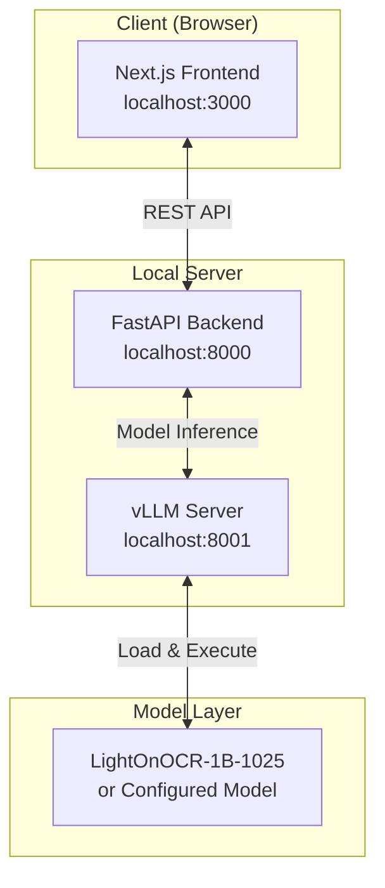
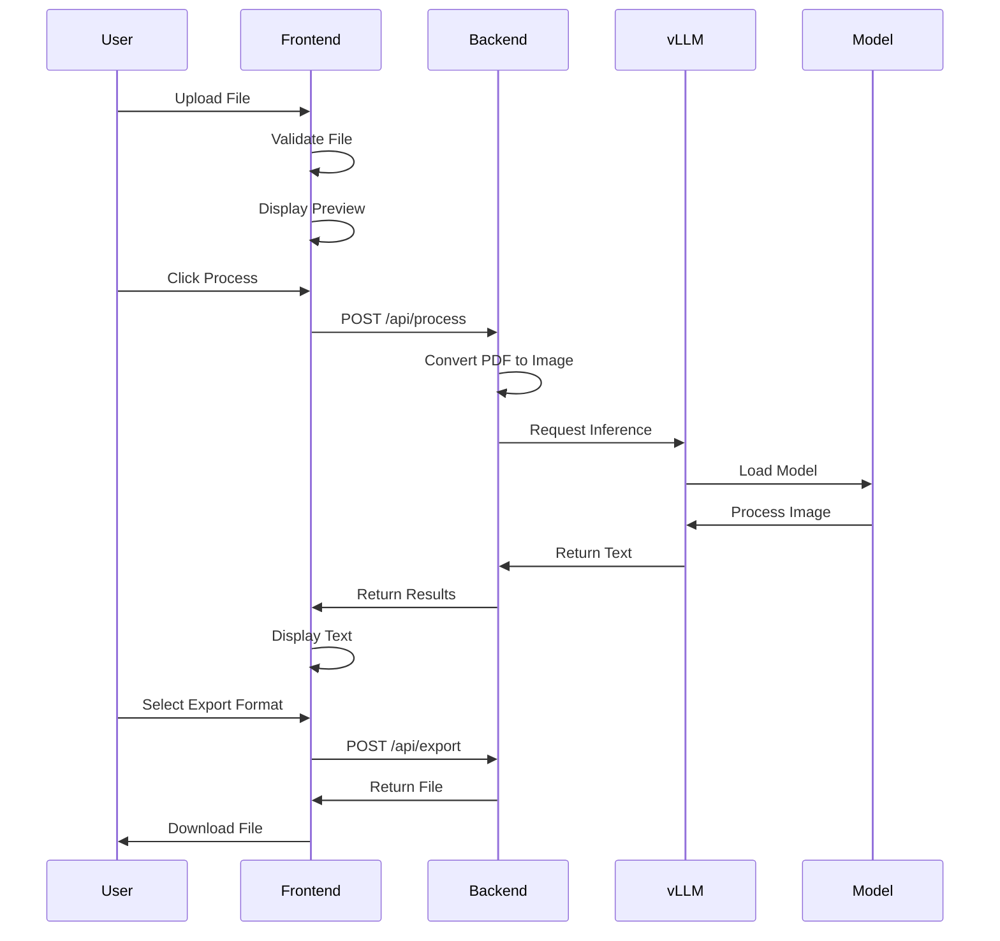

# OCR-harness Design Document

## 1. System Architecture

### 1.1 High-Level Architecture



### 1.2 Technology Stack

#### Frontend
- **Framework:** Next.js 14+ (App Router)
- **Language:** TypeScript
- **Styling:** Tailwind CSS + shadcn/ui
- **State Management:** React Context + Zustand
- **File Handling:** react-dropzone
- **PDF Rendering:** PDF.js
- **HTTP Client:** Axios
- **Export Libraries:** 
  - xlsx (Excel export)
  - papaparse (CSV handling)

#### Backend
- **Framework:** FastAPI
- **Language:** Python 3.11+
- **Model Serving:** vLLM
- **PDF Processing:** pypdfium2
- **Image Processing:** Pillow
- **Configuration:** PyYAML
- **CORS:** fastapi-cors

### 1.3 Directory Structure

```
ocr-harness/
├── frontend/
│   ├── app/
│   │   ├── layout.tsx
│   │   ├── page.tsx
│   │   └── api/
│   ├── components/
│   │   ├── ui/           # shadcn/ui components
│   │   ├── UploadZone.tsx
│   │   ├── DocumentPreview.tsx
│   │   ├── SettingsPanel.tsx
│   │   ├── ResultsView.tsx
│   │   └── ExportControls.tsx
│   ├── lib/
│   │   ├── api.ts
│   │   ├── utils.ts
│   │   └── types.ts
│   ├── hooks/
│   └── package.json
│
├── backend/
│   ├── app/
│   │   ├── main.py
│   │   ├── models/
│   │   ├── routes/
│   │   ├── services/
│   │   └── utils/
│   ├── config/
│   │   ├── models.yaml    # Model configurations
│   │   └── settings.py
│   ├── requirements.txt
│   └── start_backend.sh
│
├── scripts/
│   └── start.sh           # One-command startup
├── docker-compose.yml     # Optional container setup
└── README.md
```

### 1.4 Model Configuration Schema

```yaml
# backend/config/models.yaml
models:
  default: "lighton-ocr-1b"
  
  configurations:
    lighton-ocr-1b:
      name: "LightOnOCR-1B-1025"
      display_name: "LightOn OCR 1B (1025)"
      model_path: "lightonai/LightOnOCR-1B-1025"
      server_port: 8001
      parameters:
        temperature: 0.2
        top_p: 0.9
        max_tokens: 6500
        render_dpi: 300
        max_dimension: 1300
      requirements:
        min_ram_gb: 8
        recommended_ram_gb: 16
        gpu_recommended: true
    
    # Future model example
    custom-ocr-model:
      name: "custom-model-id"
      display_name: "Custom OCR Model"
      model_path: "path/to/model"
      # ... configuration
```

## 2. UI/UX Design

### 2.1 Layout Specification

```
┌────────────────────────────────────────────────────────────────┐
│  [Logo] OCR-harness                                            │
│         LightOn OCR 1B (1025)                    [Settings ⚙]  │
├────────────────────────────────────────────────────────────────┤
│                                                                 │
│  ┌─────────────────────┬────────────────────────────────────┐ │
│  │                     │                                    │ │
│  │    Upload Zone      │      Document Preview              │ │
│  │                     │                                    │ │
│  │  [Drag & Drop       │      [Original Document]           │ │
│  │   or Browse]        │                                    │ │
│  │                     │                                    │ │
│  │  Supported:         │      [Zoom In] [Zoom Out]          │ │
│  │  • PDF              │                                    │ │
│  │  • PNG/JPG          │                                    │ │
│  │                     │                                    │ │
│  └─────────────────────┴────────────────────────────────────┘ │
│                                                                 │
│  ┌──────────────────────────────────────────────────────────┐ │
│  │                 Extracted Text                            │ │
│  │  ┌────────────────────────────────────────────────────┐  │ │
│  │  │                                                    │  │ │
│  │  │  [Extracted text will appear here after           │  │ │
│  │  │   processing...]                                   │  │ │
│  │  │                                                    │  │ │
│  │  └────────────────────────────────────────────────────┘  │ │
│  └──────────────────────────────────────────────────────────┘ │
│                                                                 │
│  ┌──────────────────────────────────────────────────────────┐ │
│  │  [Process] [Clear]  Export as: [TXT] [CSV] [XLSX]        │ │
│  └──────────────────────────────────────────────────────────┘ │
└────────────────────────────────────────────────────────────────┘
```

### 2.2 Component Specifications

#### Header
- **Title:** "OCR-harness" in bold, large font
- **Subtitle:** Current model name in smaller, muted text
- **Settings Icon:** Opens modal with model parameters

#### Upload Zone (Left Panel)
- **Dimensions:** 30% width, 400px height
- **Style:** Dashed border, subtle background
- **States:**
  - Default: "Drag & Drop files here or click to browse"
  - Hover: Highlight with primary color
  - Processing: Disabled with loading indicator
  - Error: Red border with error message

#### Document Preview (Right Panel)
- **Dimensions:** 70% width, 400px height
- **Features:**
  - Pan and zoom controls
  - Page navigation for multi-page PDFs
  - Responsive image scaling

#### Results Panel
- **Height:** 300px (expandable)
- **Features:**
  - Scrollable text area
  - Copy-to-clipboard button
  - Line numbers (optional)
  - Text search capability

#### Settings Modal
```
┌─────────────────────────────┐
│     Model Configuration     │
├─────────────────────────────┤
│ Temperature: [====] 0.2     │
│ Top-p:      [======] 0.9    │
│ Max Tokens: [6500]          │
│                             │
│ [Reset] [Cancel] [Apply]    │
└─────────────────────────────┘
```

### 2.3 Color Scheme

```css
:root {
  --primary: #0070f3;
  --primary-dark: #0051cc;
  --background: #ffffff;
  --foreground: #000000;
  --muted: #666666;
  --border: #e5e5e5;
  --error: #ee0000;
  --success: #00aa00;
}

@media (prefers-color-scheme: dark) {
  :root {
    --background: #0a0a0a;
    --foreground: #ffffff;
    --border: #333333;
  }
}
```

## 3. API Design

### 3.1 Endpoints

#### POST /api/process
```typescript
interface ProcessRequest {
  file: File;
  config?: {
    temperature?: number;
    top_p?: number;
    max_tokens?: number;
  };
}

interface ProcessResponse {
  success: boolean;
  text?: string;
  metadata?: {
    pages: number;
    processing_time: number;
    model_used: string;
  };
  error?: string;
}
```

#### GET /api/models
```typescript
interface ModelsResponse {
  current: string;
  available: Array<{
    id: string;
    name: string;
    display_name: string;
  }>;
}
```

#### POST /api/export
```typescript
interface ExportRequest {
  text: string;
  format: 'txt' | 'csv' | 'xlsx';
  metadata?: any;
}

interface ExportResponse {
  success: boolean;
  file_url?: string;
  error?: string;
}
```

### 3.2 Error Handling

```typescript
enum ErrorCodes {
  INVALID_FILE = 'INVALID_FILE',
  PROCESSING_FAILED = 'PROCESSING_FAILED',
  MODEL_UNAVAILABLE = 'MODEL_UNAVAILABLE',
  EXPORT_FAILED = 'EXPORT_FAILED'
}

interface ErrorResponse {
  error: ErrorCodes;
  message: string;
  details?: any;
}
```

## 4. Processing Flow



## 5. Security Considerations

### 5.1 Input Validation
- File type validation (whitelist approach)
- File size limits (50MB default)
- Filename sanitization
- Content-type verification

### 5.2 Data Privacy
- No persistent storage of uploaded files
- Temporary files deleted after processing
- No logging of extracted text content
- Session-based isolation

### 5.3 API Security
- CORS configuration for frontend origin only
- Rate limiting on processing endpoints
- Request size limits
- Input sanitization

## 6. Performance Optimization

### 6.1 Frontend
- Lazy loading of components
- Image optimization with next/image
- Code splitting
- Debounced API calls

### 6.2 Backend
- Async processing with FastAPI
- Connection pooling for vLLM
- Efficient file streaming
- Memory management for large PDFs

### 6.3 Model Serving
- Model preloading on startup
- Batch processing capability
- GPU acceleration when available
- Response streaming for large outputs

## 7. Mobile Blocking Implementation

```typescript
// components/MobileBlocker.tsx
const MobileBlocker: React.FC = () => {
  const isMobile = useMediaQuery('(max-width: 768px)');
  
  if (!isMobile) return null;
  
  return (
    <div className="fixed inset-0 bg-background z-50 flex items-center justify-center p-8">
      <div className="text-center">
        <h1 className="text-2xl font-bold mb-4">Desktop Required</h1>
        <p className="text-muted-foreground">
          This OCR experience works best on desktop or laptop devices.
          Please access from a larger screen for optimal performance.
        </p>
      </div>
    </div>
  );
};
```

## 8. Configuration Management

### 8.1 Environment Variables

```bash
# Frontend (.env.local)
NEXT_PUBLIC_API_URL=http://localhost:8000
NEXT_PUBLIC_MAX_FILE_SIZE=52428800

# Backend (.env)
VLLM_SERVER_URL=http://localhost:8001
MODEL_CONFIG_PATH=./config/models.yaml
TEMP_DIR=/tmp/ocr-harness
CORS_ORIGINS=["http://localhost:3000"]
```

### 8.2 Dynamic Model Loading

```python
# backend/services/model_service.py
class ModelService:
    def __init__(self, config_path: str):
        self.config = self.load_config(config_path)
        self.current_model = self.config['default']
    
    def load_config(self, path: str) -> dict:
        with open(path, 'r') as f:
            return yaml.safe_load(f)
    
    def get_model_params(self) -> dict:
        return self.config['configurations'][self.current_model]
    
    def switch_model(self, model_id: str):
        if model_id in self.config['configurations']:
            self.current_model = model_id
            self.reload_vllm_server()
```

## 9. Testing Strategy

### 9.1 Unit Tests
- Component rendering tests
- API endpoint tests
- File processing utilities
- Export format generators

### 9.2 Integration Tests
- Full upload-to-export flow
- Model switching
- Error scenarios
- Multi-page document handling

### 9.3 E2E Tests
- Complete user workflows
- Cross-browser testing
- Performance benchmarks
- Mobile blocking verification
