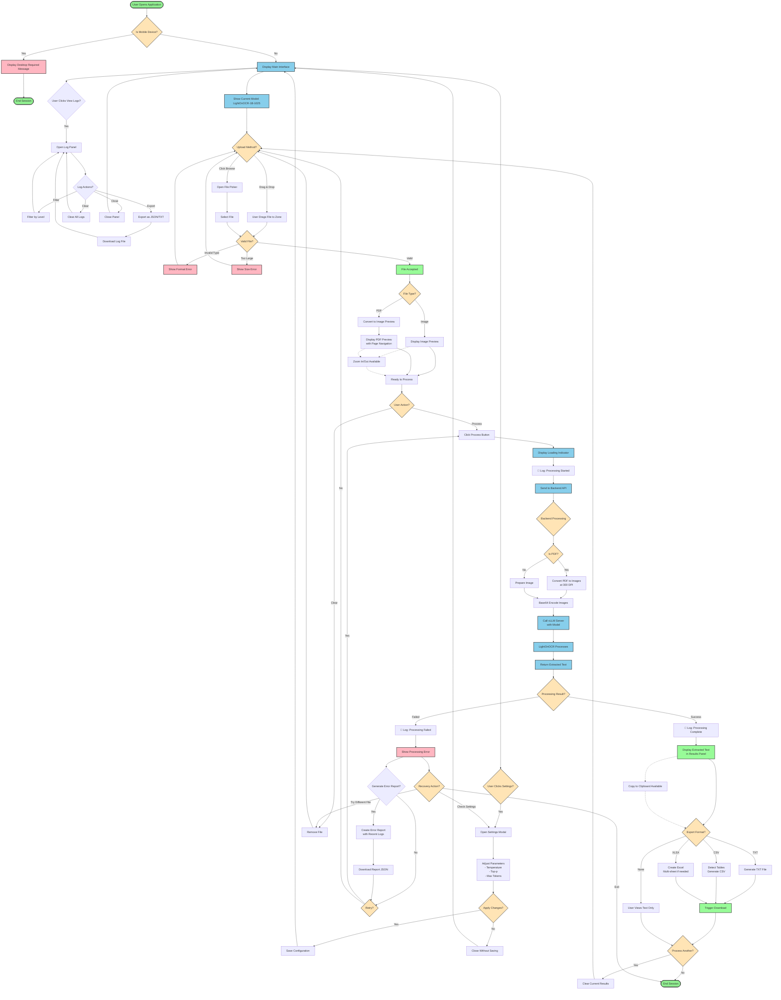

# OCR-harness User Flow Diagram

## Complete User Journey

## User Flow States Description

### Entry Points
1. **Desktop User**: Proceeds to main interface
2. **Mobile User**: Blocked with message, must switch to desktop

### Main Interaction Flows

#### Configuration Flow
- User can adjust model parameters at any time
- Settings persist for the session
- Changes apply to subsequent processing

#### Upload Flow
1. **Drag & Drop**: Direct file drop onto upload zone
2. **Browse**: Traditional file picker dialog
3. **Validation**: Automatic type and size checking
4. **Preview**: Immediate display of uploaded content

#### Processing Flow
1. **Initiation**: User clicks Process button
2. **Backend Processing**:
   - PDF conversion if needed
   - Image preparation
   - Model inference via vLLM
3. **Result Display**: Text appears in results panel

#### Export Flow
- **TXT**: Plain text with layout preservation
- **CSV**: Table detection and structured export
- **XLSX**: Multi-sheet for multi-page documents

### Error Recovery Paths
- **Invalid File**: Return to upload
- **Processing Failure**: Retry or new file
- **Network Error**: Retry after connection restored

### Parallel Features
- **Zoom Controls**: Available during preview
- **Copy to Clipboard**: Available for results
- **Settings Access**: Available at any time
- **Log Viewer**: Accessible at any time via "View Logs" button
- **Error Reporting**: Auto-triggered on critical errors

### Error Logging Flow
1. **Automatic Capture**: All errors logged without user intervention
2. **User Access**: Click "View Logs" to see system events
3. **Filtering**: Filter by INFO, WARNING, ERROR, DEBUG levels
4. **Export**: Download logs as JSON or TXT
5. **Error Reports**: Generate comprehensive report on failures
6. **Privacy**: No sensitive data (file contents) logged

## State Transitions

| From State | Action | To State | Condition |
|------------|--------|----------|-----------|
| Start | Load App | Mobile Block | Is Mobile |
| Start | Load App | Main UI | Is Desktop |
| Main UI | Click Settings | Settings Modal | Always |
| Main UI | Upload File | File Validation | Always |
| File Valid | - | Preview | Automatic |
| Preview | Process | Loading | Always |
| Loading | - | Results/Error | Based on Success |
| Results | Export | Download | Format Selected |
| Any Error | Retry | Previous State | User Choice |
| Any State | Clear | Upload Zone | User Action |

## Key Decision Points

### 1. Device Detection
- **Mobile**: Block and inform
- **Desktop**: Allow access

### 2. File Validation
- **Type Check**: PDF, PNG, JPG, JPEG, WebP, GIF
- **Size Check**: Maximum 50MB
- **Content Check**: Valid file structure

### 3. Processing Path
- **PDF**: Multi-step conversion process
- **Image**: Direct processing

### 4. Export Selection
- **User Choice**: TXT, CSV, or XLSX
- **Auto-detection**: Table structures for CSV/XLSX

## Success Criteria for User Flow

1. **Accessibility**: Desktop users can access all features
2. **Clarity**: Each step has clear feedback
3. **Recovery**: All errors have recovery paths
4. **Efficiency**: Minimum steps to complete task
5. **Flexibility**: Multiple paths to same goal

## Edge Cases Handled

1. **Large Files**: Progress indication and chunking
2. **Multi-page PDFs**: Page-by-page processing
3. **Network Interruption**: Graceful failure and retry
4. **Invalid Settings**: Validation and defaults
5. **Corrupt Files**: Error message and recovery
